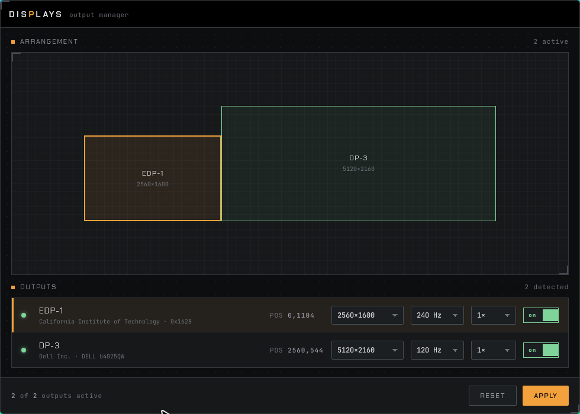

# displays

GUI output manager for Hyprland — enable/disable, arrange (drag with forced
edge-to-edge adjacency), and set resolution / refresh rate / scale per monitor.
A Wails (Go + system WebKit) app: lightweight native binary, the UI is plain
HTML/CSS/JS.



## How it works

- **Read** — `hyprctl monitors all -j` (includes disabled outputs).
- **Arrange** — dragging is free, but on drop the output snaps to the nearest
  gap-free spot: active outputs always form one connected, non-overlapping
  cluster (GNOME model). Geometry uses logical sizes (`pixels / scale`), so
  layouts stay flush for scaled outputs too.
- **Apply (live)** — for each output `hyprctl eval 'hl.monitor({...})'`.
  Takes effect instantly, no reload.
- **Confirm or revert** — an applied layout stays *pending* for 10 seconds:
  a dialog offers Keep / Revert, and if it isn't confirmed (timeout, Esc, or
  closing the window) the previous configuration is restored automatically —
  a layout that blanks the displays can't survive.
- **Persist** — confirming rewrites `~/.config/hypr/monitors.lua`, which
  `hyprland.lua` sources via `dofile()`, so the layout survives reload/reboot.
  Until confirmed, nothing touches disk.

The frontend re-reads state after Apply, so any value Hyprland adjusts
(e.g. an invalid scale snapped to a valid one) is reflected back.

## Build

Requires the toolchain from `shell.nix` (Go, Wails, WebKitGTK 4.1, Node, GTK3).

```sh
nix-shell
wails build -tags webkit2_41    # nixpkgs ships webkit2gtk abi 4.1
```

Binary: `build/bin/displays`.

## Install (Nix flake)

The repo is a flake exposing `packages.default`. The tags `desktop`,
`production`, `webkit2_41` are baked in — a plain `go build` would drop the
GTK/WebKit backend and yield a headless stub.

Run without installing:

```sh
nix run github:ovitente/tools-wl-displays
```

Imperative install into your profile:

```sh
nix profile install github:ovitente/tools-wl-displays
```

Declarative (NixOS flake): add the input, expose it via an overlay, then install
`pkgs.displays`.

```nix
# flake.nix
inputs.displays = {
  url = "github:ovitente/tools-wl-displays";
  inputs.nixpkgs.follows = "nixpkgs";
};

# overlay
(final: prev: { displays = inputs.displays.packages.${prev.stdenv.hostPlatform.system}.default; })

# module
environment.systemPackages = [ pkgs.displays ];
```

The binary lands on `PATH` as `displays`, so the Hyprland bind is just
`exec, displays` (see below).

## Dev

```sh
nix-shell --run "wails dev -tags webkit2_41"
```

## Launch

Bound to `SUPER+SHIFT+D` in the Hyprland config. `Esc` closes the window.
The window is frameless; drag it by the title bar.

## Hyprland integration

The window is frameless and meant to float. Add these rules so it always opens
floating and centered (lua config; XWayland WM_CLASS is `Displays`):

```lua
hl.window_rule({ match = { class = "(?i)displays" }, float = true })
hl.window_rule({ match = { class = "(?i)displays" }, center = true })
hl.bind("SUPER + SHIFT + D", hl.dsp.exec_cmd("displays"))
```

Classic `.conf` equivalent:

```conf
windowrule = float, class:(?i)displays
windowrule = center, class:(?i)displays
bind = SUPER SHIFT, D, exec, displays
```

(`displays` on `PATH` assumes the flake install above; otherwise point the bind
at `build/bin/displays`.)

## Notes / gotchas

- **XWayland is forced** (`GDK_BACKEND=x11`, set in `main.go`). Under the native
  Wayland backend, WebKitGTK on wlroots reports `devicePixelRatio = 1/96`, which
  shrinks the entire UI ~96×. XWayland reports the correct DPR.
- **Lua Hyprland (0.55):** `hyprctl keyword` is rejected ("can't work with
  non-legacy parsers"). Live changes use `hyprctl eval 'hl.monitor({...})'`.

## Tests

- `node tests/run.mjs` — headless e2e (puppeteer + system Chrome): stubs the Go
  backend, drives the real UI (toggle, mode change, Apply payload, drag with
  snap-on-drop adjacency, confirm/revert countdown, canvas containment),
  screenshots each step to `tests/screenshots/`, checks for console/asset errors.
- `go test ./...` — backend: availableModes parsing, scale formatting, the
  apply/confirm/revert state machine (faked hyprctl, temp $HOME), and a live
  `GetMonitors` against the running Hyprland (skipped without a session).
- `visual.sh` (lives in dotfiles: `.config/hypr/scripts/visual.sh`) — launches the
  built binary in the live Hyprland session and captures the actual WebKit render
  with grim. Run: `visual.sh -o /tmp/shot.png`. This catches WebKit-only bugs the
  headless tests can't (e.g. the devicePixelRatio issue above).
